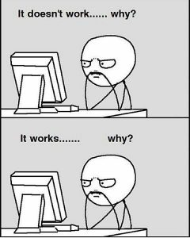

## Bonsoir 👋 

```java
class developpeurApp extends Etudiant
{
    private String _nom;
    private List<String> _passions;

    public void developpeurApp() 
    {
        super();
        this._nom = "Joseph";
        this._passions = {"Rock","vieilles voitures","Java","POO","C","jeux vidéo"};
    }

    public void sayHi()
    {
        System.out.println("Bonsoir, bienvenue chez moi");
    }

     public void goSleep()
    {
        System.out.println("Zzzzzzzz");
    }
}
```

<div align="left">
    
## Languages
</div>

<div align="center">
    
### Web
 [](https://skillicons.dev)
     
### System
 [](https://skillicons.dev)
     
 ### OOP
  [](https://skillicons.dev)
    
  </br>
</div>

<div align="left">
    
## Tools
</div>

<div align="center">
    
  [](https://skillicons.dev)
  </br>
</div>


## Musics I like
<table>
<tr>
<td width="60%">

### 🎧 Recently


</td>
<td width="40%">

### 🎵 My favorite bands

  🐒 Shaka Ponk                      
   Rock • Funk • Rap Rock  
  
  ⚡ ACDC                             
   Rock • Hard Rock  

  🐍 Metallica                       
   Heavy Metal               

  🎤 Linkin Park                     
   Nu Metal • Rap Rock     
 
... and many others

</td>
</tr>
</table>

##
<div align="center">

</div>


